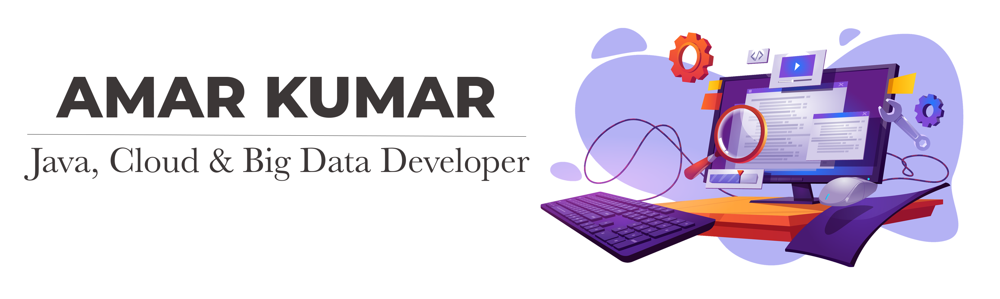

### Hello World!
I am Amar, a passionate Senior Data/Software Engineer with over 9 years of experience in the IT industry.

I specialize in Java, Cloud Technologies, and Big Data, with a strong focus on scalable architecture and optimized solutions.
I am driven by my desire to constantly learn and adapt to new technologies, leveraging my expertise in Python, data engineering, and cloud infrastructure to create efficient and robust systems. 

Beyond work, I enjoy exploring the latest advancements in technology, keeping up with best practices.
I thrive in individual contributor roles where I can dive deep into complex technical challenges.

Let’s connect and collaborate on innovative tech solutions!

## Certifications

### Verified International Academic Qualifications

  

- **Provider**: World Education Services
- **Issued**: June 2024
- **Verified by**: 
  

  <a href="https://www.credly.com/badges/aec2423f-8453-4db8-9e09-a0d6c6d28478" style="color:blue;">View certification</a>

